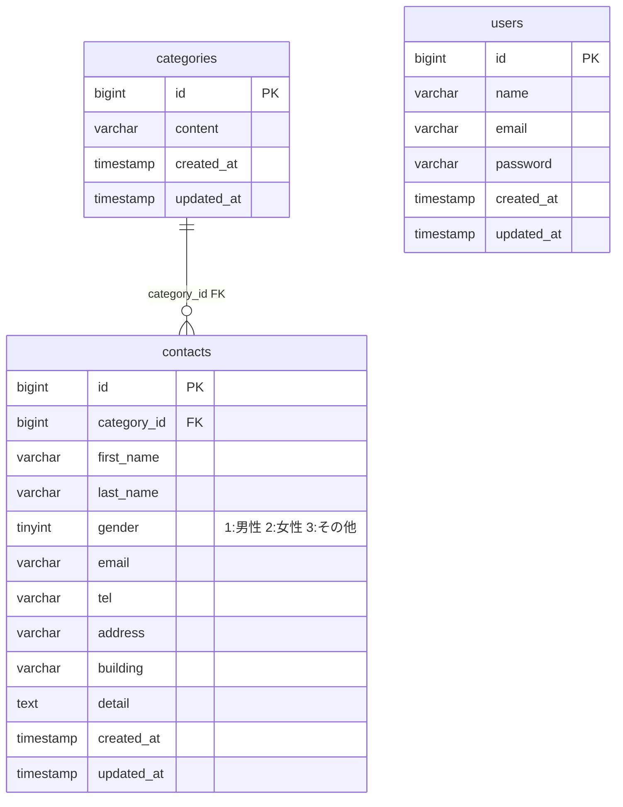

# contact-form-test

環境構築

** Dockerビルド **

1. git clone git@github.com:Haruna613/contact-form-test.git
2. DockerDesktopアプリを立ち上げる
3. docker-compose up -d --build

MacのM1・M2チップのPCの場合、no matching manifest for linux/arm64/v8 in the manifest list entriesのメッセージが表示されビルドができないことがあります。 エラーが発生する場合は、docker-compose.ymlファイルの「mysql」内に「platform」の項目を追加で記載してください。
mysql:
platform: linux/x86_64(この文追加)
image: mysql:8.0.26
environment:

** Laravel環境構築 **

1. docker-compose exec php bash
2. composer install
3. 「.env.example」ファイルを 「.env」ファイルに命名を変更。または、新しく.envファイルを作成
4. .envに以下の環境変数を追加
   DB_CONNECTION=mysql
   DB_HOST=mysql
   DB_PORT=3306
   DB_DATABASE=laravel_db
   DB_USERNAME=laravel_user
   DB_PASSWORD=laravel_pass
5. アプリケーションキーの作成
   php artisan key:generate
6. マイグレーションの実行
   php artisan migrate
7. シーディングの実行
   php artisan db:seed

** 開発環境 **
・ お問い合わせ画面 : http://localhost/
・ ユーザー登録 : http://localhost/register
・ ユーザーログイン : http://localhost/login
・ phpMyAdmin : http://localhost:8080/

** 使用技術（実行環境） **
・ php 8.4.12
・ Laravel 8.75
・ MySQL 8.0.26
・ nginx 1.21.1

** ER図 **

