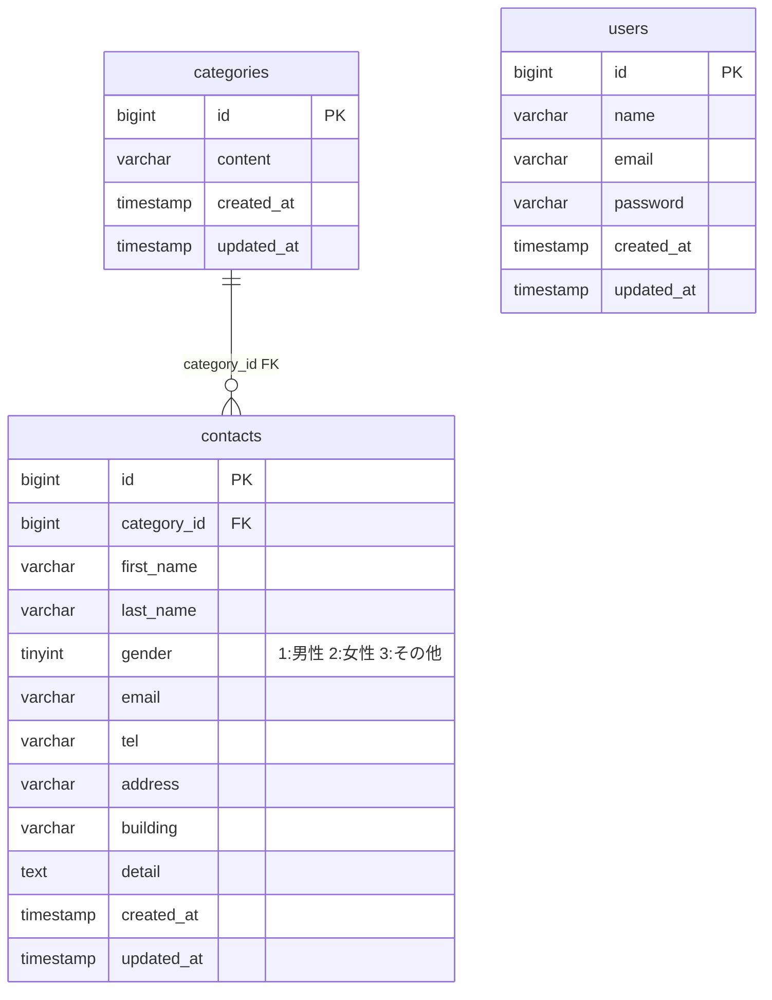

```mermaid
erDiagram
    categories ||--o{ contacts : "category_id FK"

    contacts {
        bigint id PK
        bigint category_id FK
        varchar first_name
        varchar last_name
        tinyint gender "1:男性 2:女性 3:その他"
        varchar email
        varchar tel
        varchar address
        varchar building
        text detail
        timestamp created_at
        timestamp updated_at
    }

    categories {
        bigint id PK
        varchar content
        timestamp created_at
        timestamp updated_at
    }

    users {
        bigint id PK
        varchar name
        varchar email
        varchar password
        timestamp created_at
        timestamp updated_at
    }


```
